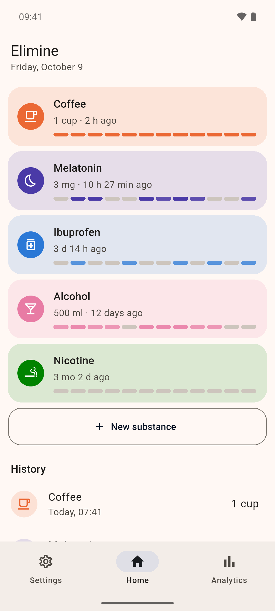
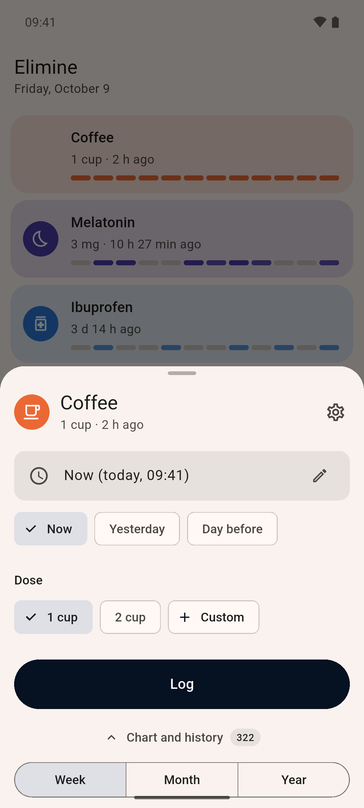
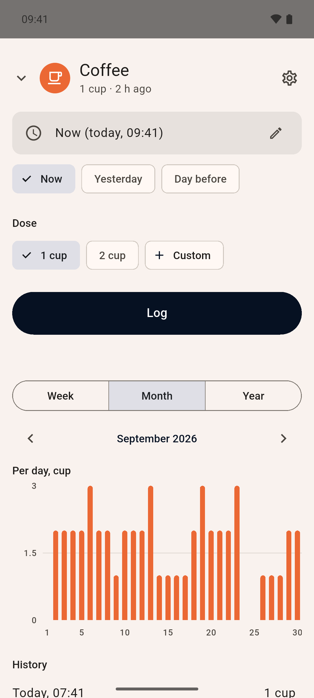
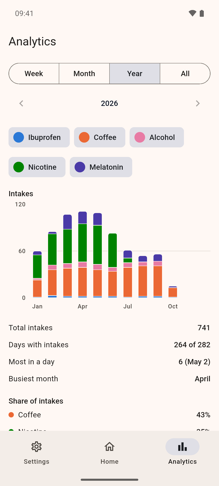

# Elimine

A private substance intake tracker for Android. Log an intake in two taps, see how often and how much over weeks, months and years, and keep all of it on your phone.

<p>
  <picture>
    <source media="(prefers-color-scheme: dark)" srcset="docs/screenshots/dark/1_home.png">
    
  </picture>
  <picture>
    <source media="(prefers-color-scheme: dark)" srcset="docs/screenshots/dark/2_log.png">
    
  </picture>
  <picture>
    <source media="(prefers-color-scheme: dark)" srcset="docs/screenshots/dark/3_substance.png">
    
  </picture>
  <picture>
    <source media="(prefers-color-scheme: dark)" srcset="docs/screenshots/dark/4_analytics.png">
    
  </picture>
</p>

## What it does

- Your own substances, each with a unit and quick dose buttons. Nothing is built in.
- Logging an intake takes two taps; the dose is optional and the time can be moved into the past.
- Home shows when you last took each substance, and the full history below.
- Edit or delete any entry; reorder substances by dragging.
- Per-substance charts and analytics by week, month and year.
- Archive substances you no longer track, or delete one together with its history.
- Export everything to a JSON file and import it back ([format](docs/backup-format.md)).
- Light and dark theme, English and Russian, each following the system or chosen in Settings.

## What it does not do

- No network: the app does not request the `INTERNET` permission.
- No accounts, no server, no sync, no ads, no telemetry.
- No cloud backup: Android's automatic backup is turned off, so data leaves the phone only as a file you export yourself.

## Install

Download `elimine-X.Y.Z.apk` from the [latest release](https://github.com/elimineapp/elimine/releases/latest) and open it on your phone. Android will ask you to allow installing apps from your browser or file manager. Newer releases install over older ones and keep your data.

Versions 0.1.0 and 0.2.0 cannot be updated in place to later ones. Export your data in Settings, uninstall, install the new version and import the file.

### Verify the download

Every release is signed with the same Elimine key. Its certificate SHA-256 fingerprint is:

```
F6:C0:B3:63:5B:42:98:F3:C8:25:B2:2A:AA:F6:F7:16:FE:9E:46:4C:CF:CF:83:20:27:6C:47:86:22:F2:51:D0
```

Check it with `apksigner verify --print-certs elimine-X.Y.Z.apk` (from the Android SDK build tools), or on the phone with an app such as [AppVerifier](https://github.com/soupslurpr/AppVerifier). If the fingerprint differs, do not install the file.

## Build from source

You need [Flutter](https://docs.flutter.dev/get-started/install) (the version CI uses is in [`.github/actions/setup/action.yml`](.github/actions/setup/action.yml)), the Android SDK and [Task](https://taskfile.dev).

```sh
task deps       # dependencies and the SQLite sources
task run        # run on a connected device or emulator
task check      # formatting, analyzer and tests
task build:apk  # release APK, signed with your debug key
```

`task --list` shows the other commands. Builds from source are signed with your own debug key, so they cannot be installed over the official releases (and the other way round) without uninstalling first.

## Releases

Versions follow [Semantic Versioning](https://semver.org) and are derived from [Conventional Commits](https://www.conventionalcommits.org) by [release-please](https://github.com/googleapis/release-please). See [CHANGELOG.md](CHANGELOG.md) and [CONTRIBUTING.md](CONTRIBUTING.md).

## License

[GPL-3.0-or-later](LICENSE)
